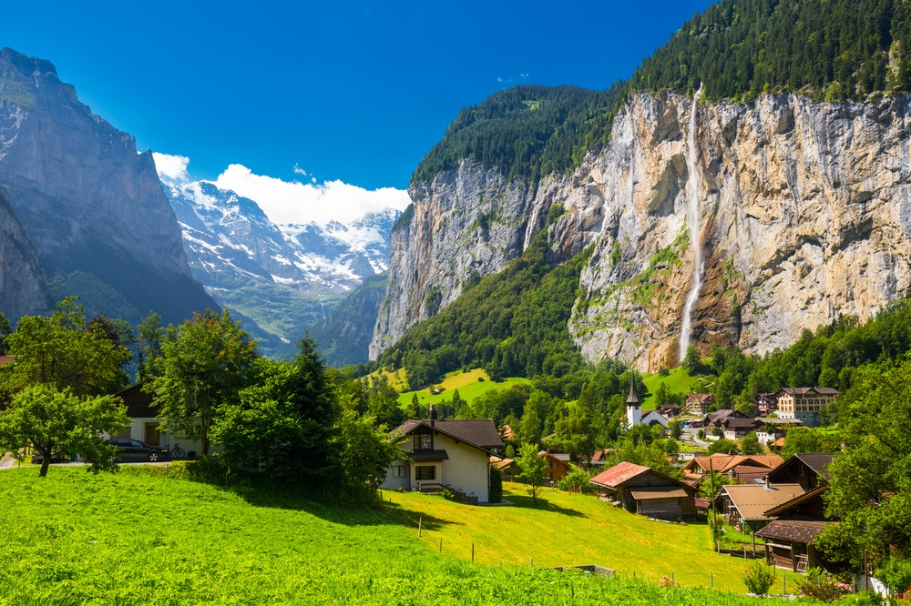

<link rel="stylesheet" href="styles.css" type="text/css">

I am a first year PhD student in the Johns Hopkins University [Cognitive Science ](https://cogsci.jhu.edu/graduate/phd-program/) program. I work with Professors [Leyla Isik](https://www.isiklab.org) and [Mick Bonner](https://bonnerlab.org).

I am a Cognitive Neuroscientist and Cognitive Scientist. My research focuses on how we perceive rich visual scences such as naturalistic landscapes and social interactions. My aim is to understand how we use high-level vision to make the complex inferences that inform our moment-to-moment actions.  

Prior to coming to JHU, I was a research assistant at the National Institute of Mental Health working with Drs. [Leslie Ungerleider](https://www.nimh.nih.gov/research/research-conducted-at-nimh/principal-investigators/leslie-ungerleider.shtml) and [Maryam Vaziri-Pashkam](https://mvaziri.github.io/Homepage/Bio.html). I received a BA in neuroscience from the University of Tennessee, Knoxville in 2017.

My full CV is available [here](files/EmalieMcMahonCV.pdf).
