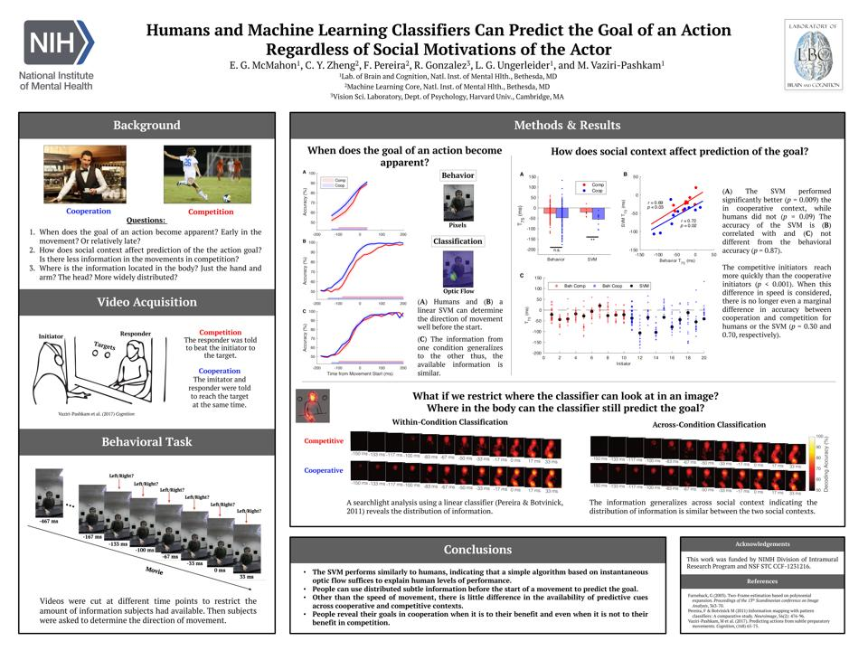
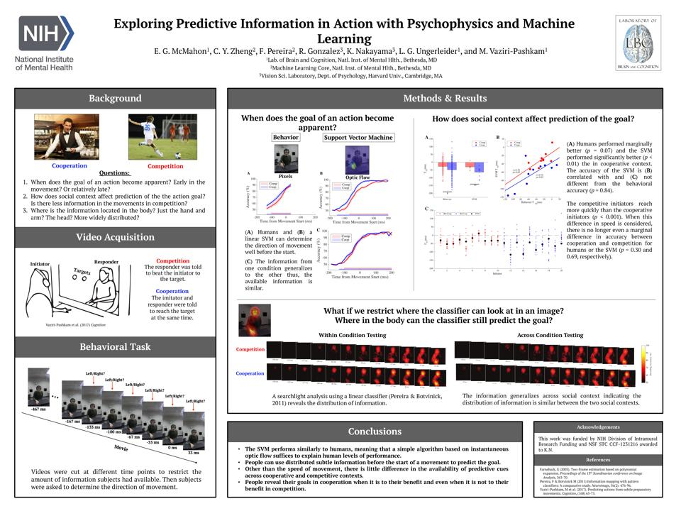
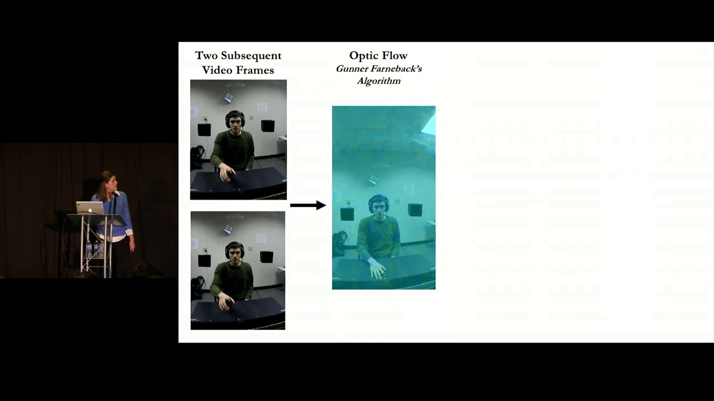

 

## VSS 2020
Vaziri-Pashkma, M., Woodward, K., <b>McMahon, E.</b>, & Ungerleider, L.G. Representations for Grasp Relevant Parts of Objects in the Human Intraparietal Sulcus. Vision Science Society; June 19 - 24, 2020; Online.
 

Woodward, K., <b>McMahon, E.</b>, Vaziri-Pashkma, M., & Ungerleider, L.G. Similarity of objects based on the way they are grasped. Vision Science Society; June 19 - 24, 2020; Online. 
  

## VSS 2019

<b>McMahon, E.</b>, Zheng, C. Y., Pereira, F., Gonzalez, R., Ungerleider, L.G., & Vaziri-Pashkam, M.  Humans and Machine Learning Classifiers Can Predict the Goal of an Action Regardless of Social Motivations of the Actor. Vision Science Society; May 17 - 22, 2019; St. Petersburg, FL.

  

## SfN 2019

<b>McMahon, E.</b>, Zheng, C. Y., Pereira, F., Gonzalez, R., Ungerleider, L.G., & Vaziri-Pashkam, M. Exploring Predictive Information in Action with Psychophysics and Machine Learning. Society for Neuroscience; Nov. 3 - 7, 2018; San Diego, CA.

  

## CCN 2018

<b>McMahon, E.</b>, Gonzalez, R., Nakayama, K., Ungerleider, L.G., & Vaziri-Pashkam, M. Understanding Action
Prediction with Machine Learning and Psychophysics. Conference on Cognitive Computational
Neuroscience; Sept. 5 – 8, 2018; Philadelphia, PA.

  

## ICIS 2018
Corbetta, D., Wiener, R.F., <b>McMahon, E.</b>, & Thurman, S.L. Duration of object visual encoding on
precision reaching in 9-month-old infants. International Congress of Infant Studies, June 30 – July 3,
2018; Philadelphia, PA.
 

## NASPSPA 2017
<b>McMahon, E.</b>, Wiener, R., DiMercurio, A., Connell, J., and Corbetta, D. An Analysis of Prospective Reaching in 9-Month-Old Infants Using Eye-Tracking. North American Society for Psychology of Sport and Physical Activity; June 4 – 7, 2017; San Diego, CA.
