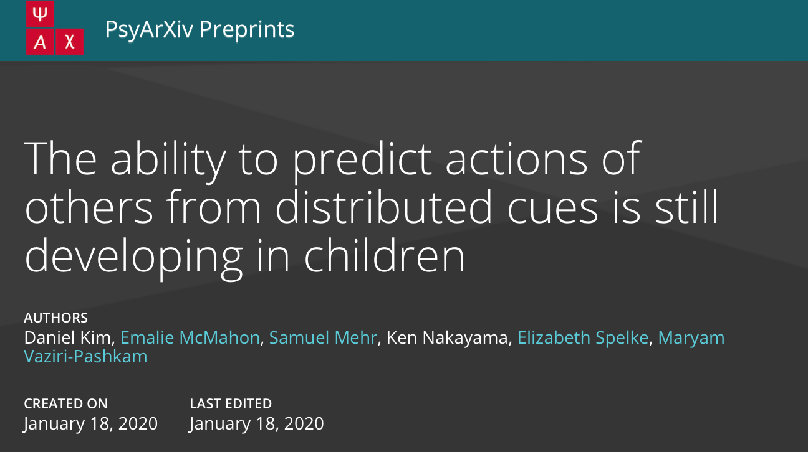
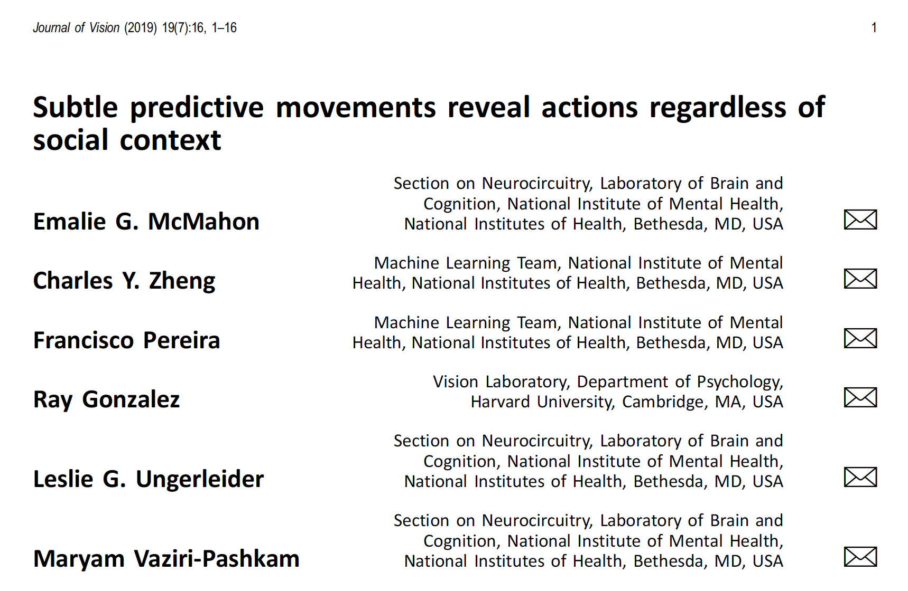
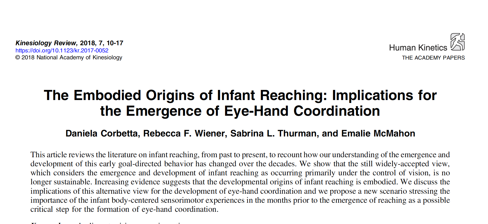

 

## Kim et al (in prep)

Kim, D., McMahon, E., Mehr, S. A., Nakayama, K., Spelke, E., & Vaziri-Pashkam, M. (2020, January 18). The ability to predict actions of others from distributed cues is still developing in children. https://doi.org/10.31234/osf.io/pu3tf

  

## McMahon et al (2019)

McMahon, E., Zheng, C. Y., Pereira, F., Gonzalez, R., Ungerleider, L.G. & Vaziri-Pashkam, M. (2017) Subtle predictive movements reveal actions regardless of social context. <i>Journal of Vision</i>, 19(7): 1-16.

  

## Corbetta et al (2018)

Corbetta, D., Wiener, R. F., Thurman, S. L., & McMahon, E. (2018). The Embodied Origins of Infant
Reaching: Implications for the Emergence of Eye-Hand Coordination. <i>Kinesiology Review</i>, 7: 10-17.

